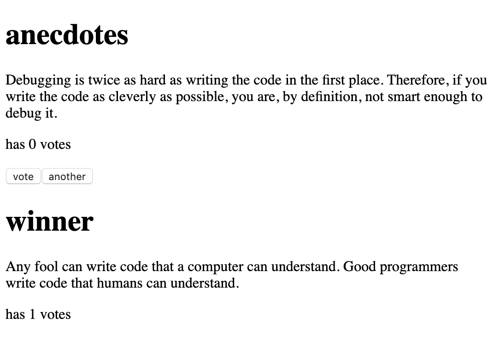
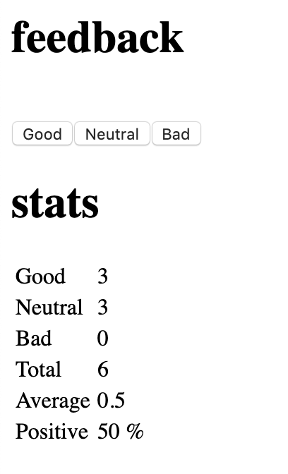
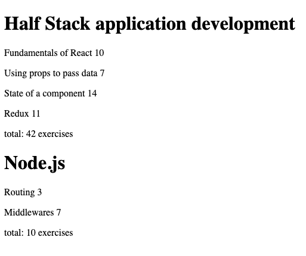
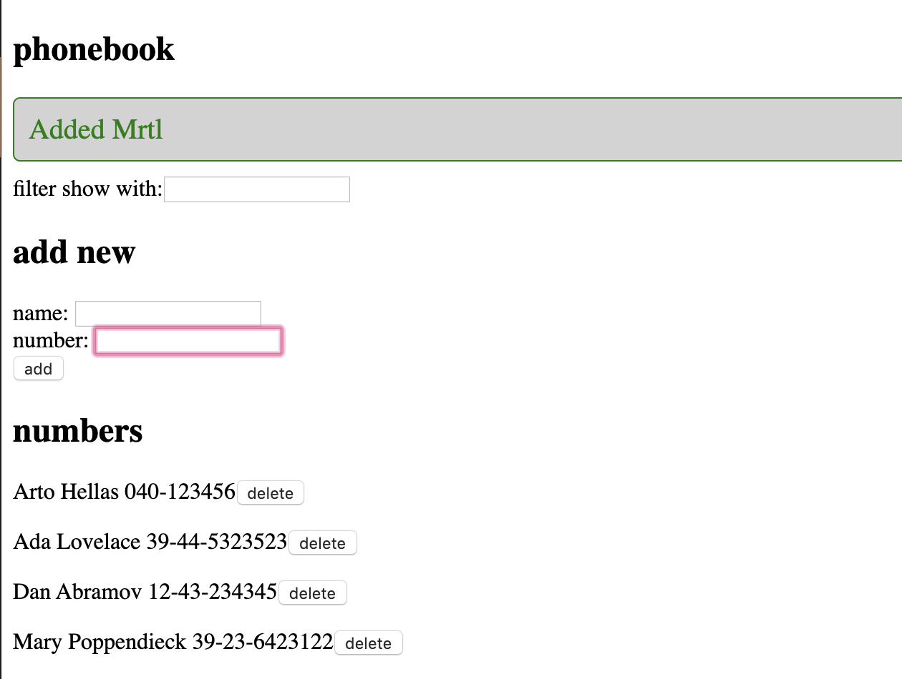

### Full stack open 2020

#### Department of Computer Science at the University of Helsinki

#### A course on modern JavaScript-based web development & building single page applications with ReactJS that use REST APIs built with Node.js.

##### React, Redux, Node.js, MongoDB, GraphQL, & TypeScript

## in progress

### solved exercises below:

- [part0](./part0) Fundamentals of Web apps

- [part1](./part1) Introduction to React

- [x] JavaScript
- [x] Component state, event handlers
- [x] Complex state & debugging

- [part2](./part2) Communicating with the server

- [x] Rendering a collection, modules
- [x] Forms
- [x] Getting data from server
- [x] Altering data in server
- [x] Adding styles to React app

